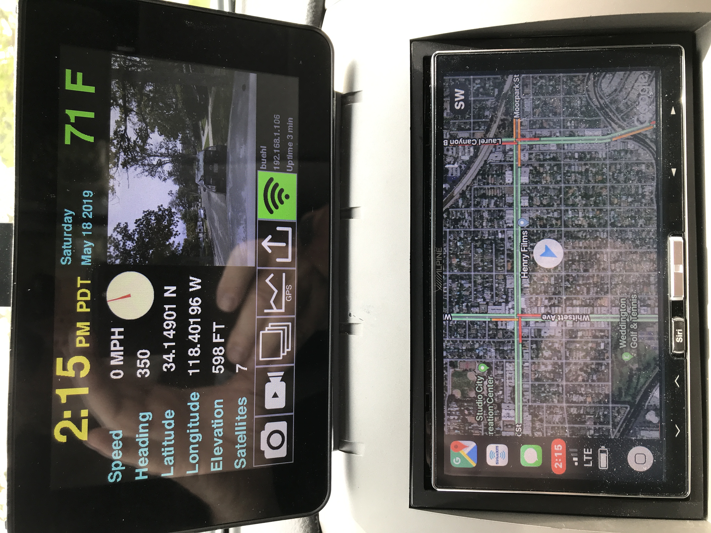

# Car computer

Software for a car computer (carputer) based on the Raspberry Pi.  This is installed in my 2008 Toyota Tacoma Prerunner.

This represents my third carputer I have built over about 15 years.  Functions such as entertainment and navigation are better handled by commercially available units so I'm not attempting to do that any more.  I have an Alpine ILX-107 with wireless CarPlay that does this as well as providing a backup camera.  This project implements some additional functions on a second screen that aren't readily available on the Alpine.

The software in this project consists of two applications that collect GPS and vehicle diagnostic data.  Both types of data are continuously logged to flat files.  The current values of each type are also written to JSON files which form the interface to the user interface application contained in the jbuehl/ha project.  That application, carApp.py, reads the GPS and diagnostic data from the JSON files, interfaces to the temperature sensor and camera module, and presents the user interface on the LCD touchscreen.

## Functions

### GPS

The GPS data displayed is

- time
- speed
- heading
- latitude
- longitude
- elevation
- number of satellites

The real time clock on the GPS board provides the current time immediately at startup and that is used to set the system time since there may not be a network connection to get it from a time server.  As soon as satellites are acquired the GPS time is used to update the RTC.  The time is stored as UTC.  The time that is displayed on the UI is converted to the time zone that the vehicle is in based on the latitude and longitude.  Speed, heading, and elevation are provided from GPS data.  Because I had some issues with accuracy of the elevation with this GPS unit, the elevation is also calculated from the latitude and longitude using the Shuttle Radar Topography Mission data.  A button on the UI allows selection of this.  The number of satellites gives an indication of the quality of the GPS data.  

### Vehicle diagnostics

Vehicle diagnostic data is acquired from the CAN bus via the OBD-II connector.  This is interfaced through the UART board and serial to USB adapter.  The data displayed is

- engine RPMs
- battery voltage
- intake air temperature
- coolant temperature
- barometric pressure
- diagnostic codes

There would have been a lot of other interesting metrics, but they aren't available in the standard OBD data that my vehicle provides.

The display toggles between GPS and diagnostic data.

### Temperature

My vehicle can have an optional outside temperature sensor, but it is not installed.  I mounted an I2C temperature sensor in front of the radiator and interfaced it to the Raspberry Pi using a CAT5 cable.

### Dash camera

The 5MP Raspberry Pi camera module is mounted in a small enclosure that is attached to the top of the carputer case.  It connects with a ribbon cable.  A window on the display constantly shows the real time image that the camera sees.  Buttons on the user interface allow capturing a still image, starting/stopping recording of video, or changing the speed of the recorded video.  Still images and videos are stored on the RaspberryPi SD card.

### Network functions

The Raspberry Pi has wifi capability.  One or more networks can be configured and it will attempt to connect to any of them that are in range.  When connected, the SSID of the network and the IP address it provided are displayed.  A button on the user interface allows the wifi to be turned on and off.  Another button initiates the upload of all the data (gps, diagnostics, images, videos) to a server.

## Hardware

More details about the hardware coming.

### Raspberry Pi 3 B+ - https://www.sparkfun.com/products/14643
### LCD touchscreen - https://www.sparkfun.com/products/13733
### Camera module - https://www.sparkfun.com/products/14028
### GPS module and RTC - https://www.adafruit.com/product/2324
### GPS antenna and adapter - https://www.amazon.com/gp/product/B00JE4GV8S https://www.amazon.com/gp/product/B01AJQ33Y4
### OBD-II UART and USB adapter - https://www.sparkfun.com/products/9555 https://www.sparkfun.com/products/9716
### Temperature sensor - http://ww1.microchip.com/downloads/en/devicedoc/21462d.pdf
### Voltage converter - https://www.amazon.com/GEREE-Waterproof-Converter-Adapter-Connector/dp/B00OXZ06I4
### Case - https://www.amazon.com/Raspberry-Pi-7-Inch-Touch-Screen/dp/B01GQFUWIC
### Camera case - https://www.amazon.com/gp/product/B00IJZOT5A

## Software

### Raspbian - https://www.raspberrypi.org/downloads/raspbian/
### My Home Automation project - https://github.com/jbuehl/ha
