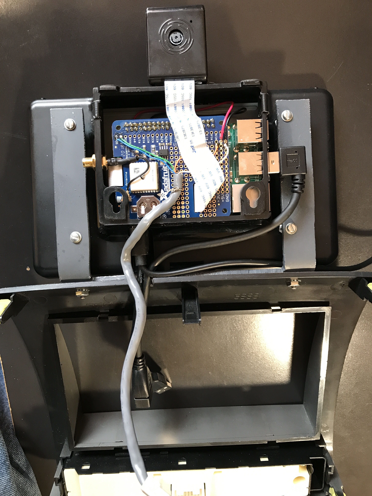

# Car computer

Software for a car computer (carputer) based on the Raspberry Pi.  This is installed in my 2008 Toyota Tacoma Prerunner.

This is the third carputer I have built over a period of about 15 years.  At first I tried to implement everything, but over time I realized that functions such as entertainment and navigation are better handled by commercially available units so I'm not attempting to do that any more.  I have an Alpine ILX-107 with wireless CarPlay connected to my iPhone that does these things as well as providing a backup camera.  For music I like to use Spotify or SiriusXM and for navigation I prefer Google Maps.  With this project I am focusing on some additional functions on a second screen that aren't readily available on the Alpine.

The software in this project consists of two applications that collect GPS and vehicle diagnostic data.  Both types of data are continuously logged to files.  The current values of each type are also written to files which are monitored by the user interface application contained in the https://github.com/jbuehl/ha project.  That application reads the GPS and diagnostic data from the current files, interfaces to the temperature sensor and camera module, and presents the user interface on the LCD touchscreen.

The Alpine unit is mounted in the dash and the carputer is attached to the bezel with an aluminum bracket that I fabricated.  The camera is mounted on the top of the Raspberry Pi case with double sided tape.

## Functions

### Time

The real time clock on the GPS board provides the current time immediately at startup and that is used to set the system time since there may not be a network connection to get it from a time server.  As soon as satellites are acquired the GPS time is used to update the RTC.  The system time is maintained as UTC.  The time and date that is displayed on the UI is converted to the local time zone that the vehicle is in based on the latitude and longitude reported by the GPS.

### Temperature

My vehicle can have an optional outside temperature sensor, but it is not installed.  I mounted an I2C temperature sensor in front of the radiator and interfaced it to the Raspberry Pi using a CAT5 cable.  The TC74 sensor only has a resolution of 1 degree C.  A better choice would be a DS18B20 which uses the 1-wire interface.

### GPS

The GPS data displayed is

- speed
- heading
- latitude
- longitude
- elevation
- number of satellites

Speed, heading, and elevation are provided from GPS data.  Because I had some issues with accuracy of the elevation with this GPS unit, the elevation is also calculated from the latitude and longitude using the Shuttle Radar Topography Mission data.  A button on the UI allows selection of this.  The number of satellites gives an indication of the quality of the GPS data.  

### Vehicle diagnostics

Vehicle diagnostic data is acquired from the CAN bus via the OBD-II connector.  This is interfaced through the UART board and serial to USB adapter.  The data displayed is

- engine RPM
- battery voltage
- intake air temperature
- coolant temperature
- barometric pressure
- diagnostic codes

There would have been a lot of other interesting metrics, but they aren't available in the standard OBD data that my vehicle provides.

The display can be toggled between GPS and diagnostic data.

### Dash camera

The 8MP Raspberry Pi camera module is mounted in a small enclosure that is attached to the top of the carputer case.  It connects with a ribbon cable.  A window on the display constantly shows the real time image that the camera sees.  Buttons on the user interface allow capturing a still image, starting/stopping recording of video, or changing the speed of the recorded video.  Still images and videos are stored on the RaspberryPi SD card.

### Network functions

The Raspberry Pi has wifi capability.  One or more networks can be configured and it will attempt to connect to whichever one of them is in range.  When connected, the SSID of the network and the IP address it provided are displayed.  A button on the user interface allows the wifi to be turned on and off.  Another button initiates the upload of all the data (GPS, diagnostics, images, videos) to a server.

## Hardware

These photos show the assembly.

This photo shows how the Raspberry Pi case is mounted on the dashboard adapter.  I fabricated a U shaped bracket from a piece of 1/16" aluminum which is bolted to the plastic dashboard adapter and the case is attached to that.  The camera case is attached to the top of the Pi case and points to the front of the vehicle.  The display case is mounted upside down so that the micro USB power connectors are on the bottom and also to provide a flat surface to mount the camera at the top.  The image is easily inverted by making a change to a startup configuration file.

View from the back of the case showing the 4 screws that mount the Pi case to the arms of the bracket.  I made a notch in the bracket and the dashboard adapter to allow the cables to pass through.  The cable supplying power connects to the micro USB connector of the Raspberry Pi.  The other USB cable with the right angle connector is plugged into a USB port and connects to the OBD-II adapter.  The gray cable is a CAT-5 cable that connects the temperature sensor to the I2C interface.  Not shown is the coax cable from the GPS antenna that connects to the gold connector on the left side of the case.

Close up of the GPS module and RTC board.  This board plugs into the 40 pin connector of the Raspberry Pi beneath it.  The Pi is mounted above the LCD display board that mounts to the case.  The red and black wires at the top right corner connect +5v and GND to the LCD display board beneath the Raspberry Pi.  Both that board and the Pi have micro USB connectors that are exposed through the case so if power lines of the boards are connected together internally, only one or the other needs to be powered from a USB connector assuming the power supply has enough capacity.  Four conductors of the gray CAT-5 cable are connected to +3.3v, GND, SDA, and SCL on the board.  The white ribbon cable goes from the camera, through a slot in the GPS board, and on to the camera connector on the Raspberry Pi.  The short GPS antenna adapter connects from the U.FL connector on the board to a coax connector mounted in the left side of the case.  The other white ribbon cable just visible at the left side of the board goes to the display board.

### Raspberry Pi 3B+ - https://www.sparkfun.com/products/14643

You can either use a 3B or 3B+.

### LCD touchscreen - https://www.sparkfun.com/products/13733

This connects to the Raspberry Pi with a ribbon cable.  Power is supplied by jumpers that I connected to the GPS board.

### Camera module - https://www.sparkfun.com/products/14028

Can be either the V1 or V2 camera.

### GPS module and RTC - https://www.adafruit.com/product/2324

This is a nice kit that provides the GPS module, a real time clock, and breakouts for all the Raspberry Pi pins.  A CR1220 battery is required but not included.

### GPS antenna and adapter - https://www.amazon.com/gp/product/B00JE4GV8S https://www.amazon.com/gp/product/B01AJQ33Y4

Having an external antenna is necessary if you have the camera module because the camera ribbon cable emits a lot of noise that prevents the GPS from working properly.

### OBD-II UART, OBD-II cable, and USB adapter - https://www.sparkfun.com/products/9555 https://www.sparkfun.com/products/10087 https://www.sparkfun.com/products/9716

I have these mounted in a separate plastic enclosure under the dash with a mini USB cable that connects to the Raspberry Pi.

### Temperature sensor - http://ww1.microchip.com/downloads/en/devicedoc/21462d.pdf

This is a temperature sensor that I happened to have in the parts bin.  Even though it's working for me, I don't recommend using it.  A better choice would be the 1-Wire DS18B20 https://www.amazon.com/Adafruit-Accessories-Waterproof-DS18B20-Digital/dp/B00NAY24KW.

### Voltage converter - https://www.amazon.com/GEREE-Waterproof-Converter-Adapter-Connector/dp/B00OXZ06I4

This is wired to the 12v line that is switched by the ignition.  There are two USB connectors that supply 5v.  One powers the carputer and I use the other one to charge my phone.

### Case - https://www.amazon.com/Raspberry-Pi-7-Inch-Touch-Screen/dp/B01GQFUWIC

A very nice case.  I have it mounted upside down for a couple of reasons.

### Camera case - https://www.amazon.com/gp/product/B00IJZOT5A

This is a horrible little case that required a lot of modification to make it work, but I couldn't find a better one.  Read my Amazon review for details on the problems that I had https://www.amazon.com/gp/customer-reviews/R3LHYJAJY1Q1UC/ref=cm_cr_arp_d_rvw_ttl?ie=UTF8&ASIN=B00IJZOT5A.

### Dashboard adapter - https://www.amazon.com/gp/product/B0014KOA42

The carputer is mounted on this aftermarket dash kit that the Alpine unit fits in.  Of course this is specific to my vehicle.

## Software

### Raspbian - https://www.raspberrypi.org/downloads/raspbian/

I'm using the Stretch Lite version.  The later Buster version had stability issues so I stuck with Stretch, but that is probably fixed by now.  The Lite version doesn't include the windowing environment which isn't needed which results in a very fast boot time.

To invert the LCD image, the line "lcd_rotate=2" needs to be added to /boot/config.txt.

### gps.py

This application continuously reads NMEA formatted data from the GPS unit and writes it to two files.  The data is appended without any modification to a log file and is also parsed and selected values are written once per second to another file in JSON format.  The JSON file is overwritten each time so it contains only the most current values.

Once a valid GPS time is acquired, the system clock is set to that value and periodically updated.

The GPS data that is parsed includes the altitude.  Because I had some issues with accuracy of the altitude data with this GPS unit, the altitude is also calculated using the latitude and longitude to look up the value in a table of the Shuttle Radar Topography Mission data.  The format of this data is described here http://fileformats.archiveteam.org/wiki/HGT.  Use of this is optional.  If the application cannot find a file that corresponds to the current latitude and longitude, the GPS altitude is used.  My accuracy issue turned out to be caused by interference emitted from the camera cable and was ultimately resolved with the addition of an external antenna.  The accuracy of SRTM data is about the same as GPS, so if you are getting good GPS data there's really no point in bothering with SRTM.

The GPS app is automatically started as a systemd service upon startup.

### diags.py

The diagnostics app initializes the OBD-II adapter through the USB serial port, periodically reads data from the CAN bus, and writes it to two files.  Like the GPS data, both a log of individual data points and a file containing just the last set of values are written.

The diagnostics app is automatically started as a systemd service upon startup.

### carApp.py - https://github.com/jbuehl/ha/blob/master/carApp.py

This application provides the user interface that was described previously.

I chose to use a low level interface to the frame buffer rather than using a windowing environment primarily to reduce the startup time.  The UI is implemented by the DisplayUI module.  The UI is built using a set of classes that I developed that somewhat mimics how a HTML/CSS web UI is built.  The low level interface to the screen is implemented by a small C++ module fb.cpp.

The app is automatically started as a systemd service upon startup.

## Future plans

- 1-Wire temperature sensor
- Front distance detector to assist in parking
- Separate from the jbuehl/ha project for simplicity
